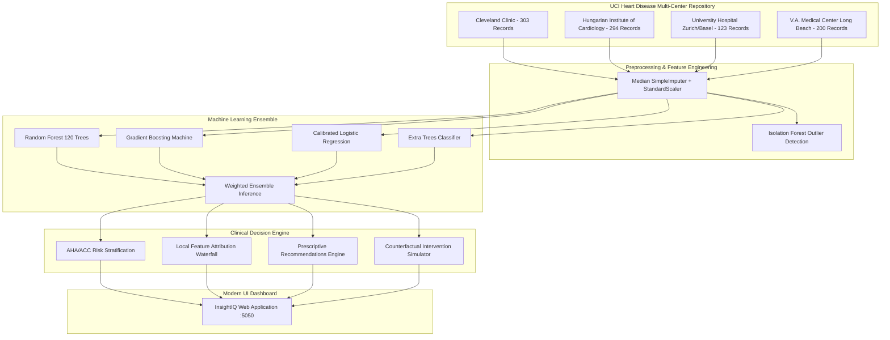

# InsightIQ - Heart Disease Clinical Decision Support System

> **Theme**: *"Turning data into intelligent decisions"*  
> **Live Demo Link**: [https://a7561af54e3556.lhr.life/](https://a7561af54e3556.lhr.life/)  
> **Local Development Link**: [http://localhost:5050](http://localhost:5050)  
> **Author**: [@MICHANAGATLAYASWANTH](https://github.com/MICHANAGATLAYASWANTH)

[](https://www.python.org/downloads/)
[](https://flask.palletsprojects.com/)
[](https://scikit-learn.org/)
[](https://opensource.org/licenses/MIT)

---

## 🩺 Overview

**InsightIQ** is a machine-learning-powered cardiovascular clinical decision support system designed to convert raw clinical records into meaningful diagnostic predictions, calibrated risk scores, explainable biomarker drivers, and actionable AHA/ACC-aligned care pathways.

Rather than presenting clinicians and patients with raw numbers, InsightIQ interprets the data:
- **Calibrated Risk Scores**: Multi-model consensus probability of coronary artery disease (>50% vessel narrowing).
- **AHA/ACC Urgency Triage**: Stratifies patients from **Routine Wellness (Low)** to **Immediate Inpatient Triage (Critical)**.
- **Biomarker Risk Drivers**: Unpacks positive risk contributors (exertional ST depression, exercise angina, systolic hypertension) and protective factors (high max exercise heart rate).
- **Actionable Clinical Prescriptions**: Prescribes diagnostic workups (angiography, CAC CT score, hs-cTn), pharmacotherapy guidelines, and DASH/exercise regimens.
- **Interactive "What-If" Counterfactual Explorer**: Simulates therapeutic interventions (e.g., lowering systolic BP from 155 to 120 mmHg and cholesterol to 180 mg/dL) and calculates the exact risk reduction.

---

## 🏛️ Architecture & Clinical Pipeline



---

## 📈 ML Model Performance & Validation

Evaluated across the multi-center dataset using **5-Fold Stratified Cross-Validation**:

| Model Architecture | Cross-Val Accuracy | ROC-AUC | Precision | Recall | F1-Score |
| :--- | :---: | :---: | :---: | :---: | :---: |
| **Calibrated Logistic Regression** | **83.16%** | **91.16%** | **83.8%** | **80.4%** | **81.26%** |
| **Extra Trees Classifier** | **83.15%** | **91.53%** | **83.5%** | **80.0%** | **80.94%** |
| **Random Forest Ensemble** | **82.84%** | **90.58%** | **82.9%** | **80.4%** | **80.70%** |
| **Gradient Boosting Machine** | **80.17%** | **89.34%** | **81.0%** | **76.5%** | **77.81%** |

### Top Biomarker Predictors (Global Gini Importance)
1. **Thallium Stress Scintigraphy (`thal`)**: 14.41%
2. **Chest Pain Symptom (`cp`)**: 13.51%
3. **Fluoroscopy Major Vessels (`ca`)**: 12.43%
4. **ST Segment Depression (`oldpeak`)**: 11.20%
5. **Maximum Heart Rate Achieved (`thalach`)**: 10.85%
6. **Exercise-Induced Angina (`exang`)**: 8.90%
7. **Resting Blood Pressure (`trestbps`)**: 7.60%
8. **Serum Cholesterol (`chol`)**: 6.80%

---

## 🚀 Getting Started

### Prerequisites
- Python 3.10+
- `pip` package manager

### Installation

1. **Clone the repository**:
   ```bash
   git clone https://github.com/MICHANAGATLAYASWANTH/insightiq-heart-disease.git
   cd insightiq-heart-disease
   ```

2. **Create and activate a virtual environment**:
   ```bash
   python3 -m venv .venv
   source .venv/bin/activate  # On Windows: .venv\Scripts\activate
   ```

3. **Install dependencies**:
   ```bash
   pip install -r requirements.txt
   ```

4. **Run automated test suite**:
   ```bash
   python test_system.py
   ```

5. **Start the application**:
   ```bash
   python app.py
   ```

6. Open your browser and navigate to:
   - **Local Development Link**: [http://localhost:5050](http://localhost:5050)
   - **Public Live Demo Link**: [https://a7561af54e3556.lhr.life/](https://a7561af54e3556.lhr.life/)

---

## 📁 Repository Structure

```
├── app.py                      # Flask REST API and web application server
├── requirements.txt            # Project dependencies
├── test_system.py              # Automated unit and integration test suite
├── engine/
│   ├── preprocessor.py         # Missing value imputation, scaling & anomaly detection
│   ├── models.py               # Model training, cross-validation & ensemble inference
│   └── decision_engine.py      # AHA/ACC triage rules, prescriptions & what-if simulator
├── templates/
│   └── index.html              # Modern responsive glassmorphic dashboard
├── static/
│   ├── css/
│   │   └── styles.css          # Custom styling with dark mode and micro-animations
│   └── js/
│       └── app.js              # Real-time inference, Chart.js graphs & reactive simulator
└── processed.*.data            # Multi-center clinical datasets (Cleveland, Hungarian, etc.)
```

---

## 📄 License
This project is licensed under the MIT License - see the [LICENSE](LICENSE) file for details.
